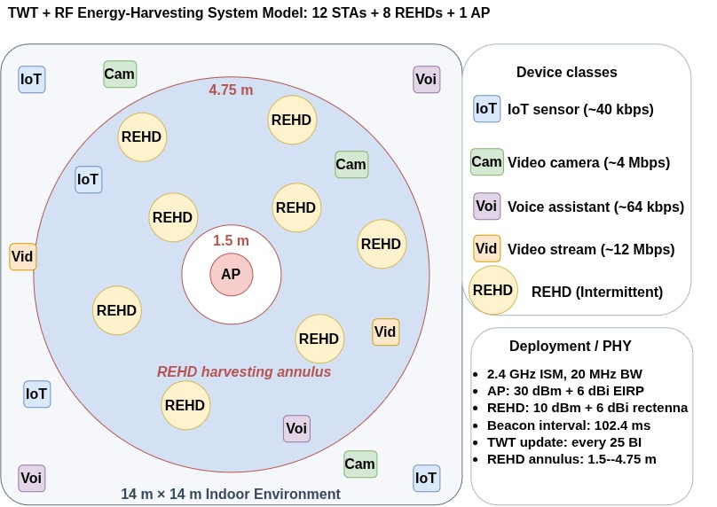
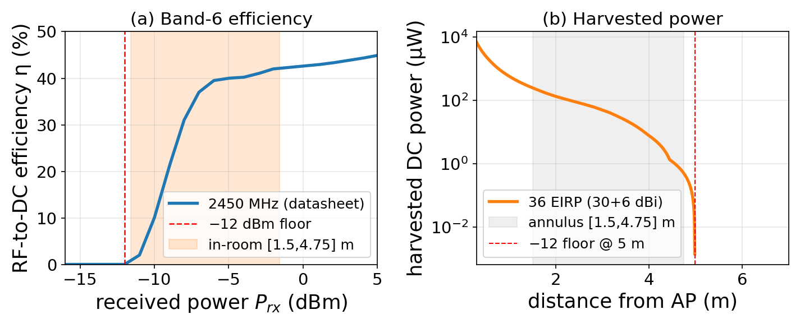
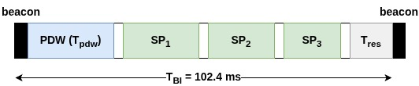
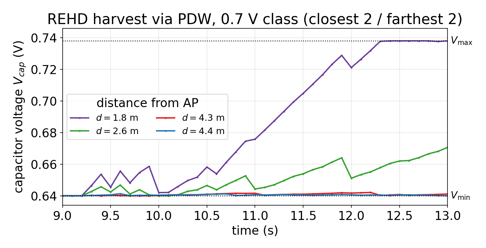
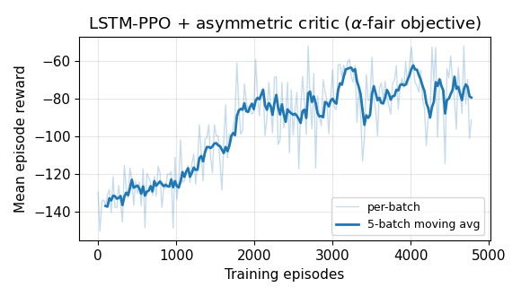
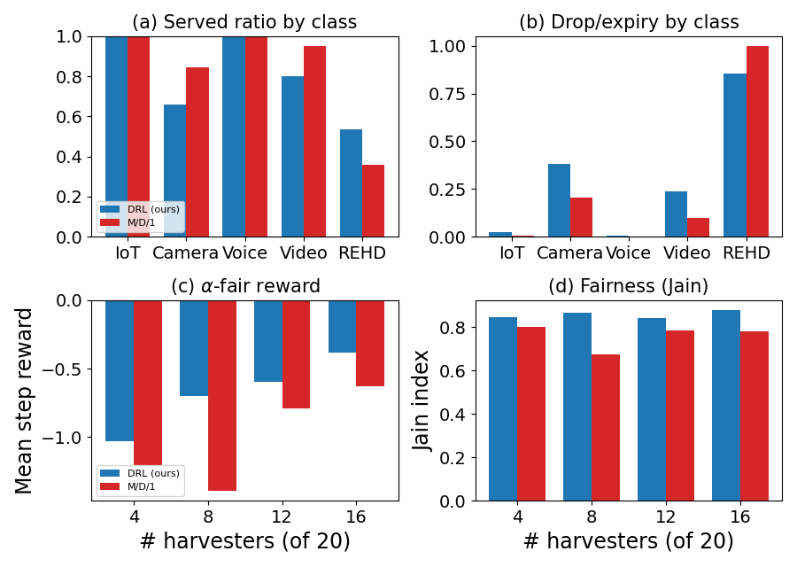

# PowerCast-TWT: Deep RL Co-Design of 802.11ax TWT Scheduling and RF Energy Harvesting

<p align="center">
  
  
  
  
  <a href="https://doi.org/10.1145/3842432.3843784"></a>
</p>

A reinforcement-learning framework that co-designs **802.11ax Target Wake Time (TWT) scheduling** with **PowerCast RF energy harvesting**.
An NS-3 simulation runs the full WiFi MAC/PHY for a heterogeneous cell of traditional stations (IoT / camera / voice / video) and **REHD** nodes — battery-free sensors that harvest the access point's RF emissions while asleep and spend the stored charge on uplink.
A recurrent PPO agent decides, on every scheduling call, the TWT group configuration, the station→group assignment, and a dedicated **Power Delivery Window (PDW)** during which the AP beams energy to the sleeping harvesters.
All NS-3 ↔ Python communication is over `ns3-ai` shared memory (no sockets / files on the hot path).

The control problem is a partially-observed scheduling task: the AP must keep throughput-hungry STAs served *and* keep the energy-harvesting sensors alive, while it is **blind to which station is which** — it must infer the hidden REHD/traffic layout from the realistic protocol signals it can actually observe.

Code for the paper:

> **A. Maksud and M. M. Carvalho**, "Co-Designing TWT Scheduling and RF Energy Harvesting for Sustainable Heterogeneous Wi-Fi: A Deep Reinforcement Learning Approach,"
> in *Proc. Workshop on Mobility in the Evolving Internet Architecture (MobiArch '26)*, Austin, TX, USA, Oct. 2026, 6 pages.
> DOI: [10.1145/3842432.3843784](https://doi.org/10.1145/3842432.3843784)

If you use this code, please cite the paper (see [Citation](#19-citation)).

**Author**: Ahmed Maksud — SHINE Lab, Texas State University\
**PI**: Prof. Marcelo Menezes De Carvalho

---

> **Important**: This project requires a working **NS-3 3.44 + ns3-ai** tree, e.g. from the [NS3-NS3AI installation](https://github.com/ahmedmaksud/NS3-NS3AI--installation-and-tests) repo, and a Python 3.11 virtualenv.
> The default layout every driver script assumes is:

```
~/NS3-project/
├── EHRL/                                 ← Python 3.11 venv (override with VENV=...)
└── ns-allinone-3.44/
    └── ns-3.44/                          ← ns3-root
        └── contrib/ai/examples/
            └── rl-twt-powercast/         ← this repo, cloned under this name
```

> **The directory name is fixed.** `twt-constants.h` (config + output paths), `CMakeLists.txt` (where the pybind `.so` is deployed) and `setup_fresh_ns3.sh` (the `add_subdirectory()` line) all hardcode `rl-twt-powercast`; `CMakeLists.txt` and `setup_fresh_ns3.sh` check it and stop with an error on a mismatch rather than silently building nothing.

## Quick Start

```bash
# 1. Clone the repository into the ns3-ai examples directory, under the required name
cd ~/NS3-project/ns-allinone-3.44/ns-3.44/contrib/ai/examples/
git clone https://github.com/ahmedmaksud/PowerCast-TWT-DRL-DynamicTraffic--MobiArch26.git rl-twt-powercast

# 2. Apply the NS-3 WiFi patches + register the build subdir (once, before the first build)
bash rl-twt-powercast/setup_fresh_ns3.sh

# 3. Python deps into the venv
source ~/NS3-project/EHRL/bin/activate
pip install -r rl-twt-powercast/requirements.txt

# 4. Configure + build (pin the venv python — see §12)
cd ~/NS3-project/ns-allinone-3.44/ns-3.44
./ns3 configure --enable-examples --enable-tests -- -DNS3_PYTHON_BINDINGS=ON \
    -DPython3_EXECUTABLE="$HOME/NS3-project/EHRL/bin/python3.11" \
    -DCMAKE_PREFIX_PATH="$(python3.11 -m pybind11 --cmakedir)"
./ns3 build

# 5. Smoke-test the C++/Python bridge, then run the full pipeline
python3.11 contrib/ai/examples/rl-twt-powercast/test-scripts/twt_smoke_one_worker.py
bash contrib/ai/examples/rl-twt-powercast/run_pipeline.sh      # tables → plots → EDA → train → eval
```

`run_pipeline.sh` runs the experiment end-to-end in five stages: **(0)** carve the action tables, **(1)** harvest/Vcap plots (shows RF harvesting is happening), **(2)** full EDA + obs-normalization fit, **(3)** training (`lstm_ppo` + asymmetric critic, `twt_pf_demand_v5` reward), **(4)** structured per-device evaluation against the M/D/1 analytical baseline.
Every stage is independently toggleable and tunable via env vars (§13).

For an exact, paper-pinned reproduction — the parameters that produced the committed figures, checkpoint and evaluation — use `reproduce.sh` instead: it wraps `run_pipeline.sh` with the paper's arguments and adds the clean-build, Vcap-trace and figure-regeneration bookends.

---

## Table of Contents

- [1. Overview](#1-overview)
- [2. System Architecture](#2-system-architecture)
- [3. The Physical Scenario](#3-the-physical-scenario)
- [4. NS-3 Simulation Source Files](#4-ns-3-simulation-source-files)
  - [`twt-constants.h`](#twt-constantsh)
  - [`pb-twt-core.h`](#pb-twt-coreh)
  - [`ph-harvester-hardware.h` / `.cc`](#ph-harvester-hardwareh--cc)
  - [`ph-deployment-helper.h` / `.cc`](#ph-deployment-helperh--cc)
  - [`twt-simulation-config.h` / `.cc`](#twt-simulation-configh--cc)
  - [`twt-trace-callbacks.h` / `.cc`](#twt-trace-callbacksh--cc)
  - [`twt-metrics.h` / `.cc`](#twt-metricsh--cc)
  - [`pb-twt-wrapper-ns3.h` / `.cc`](#pb-twt-wrapper-ns3h--cc)
  - [`pb-twt-interface.cc`](#pb-twt-interfacecc)
  - [`pb_twt_wrapper_py.py`](#pb_twt_wrapper_pypy)
  - [`twt-powercast-main-simulation.cc`](#twt-powercast-main-simulationcc)
- [5. How the Trace Callbacks Work](#5-how-the-trace-callbacks-work)
- [6. Metrics Collection: Two-Level Design](#6-metrics-collection-two-level-design)
- [7. C++–Python Bridge: NS3-AI Shared Memory](#7-cpython-bridge-ns3-ai-shared-memory)
- [8. NS-3 Source Modifications (`mod-files/`)](#8-ns-3-source-modifications-mod-files)
- [9. RL Formulation](#9-rl-formulation)
- [10. Policy and the Asymmetric Critic](#10-policy-and-the-asymmetric-critic)
- [11. Exploratory Data Analysis](#11-exploratory-data-analysis)
- [12. Build](#12-build)
- [13. One-Stop Pipeline: `run_pipeline.sh` and `reproduce.sh`](#13-one-stop-pipeline-run_pipelinesh-and-reproducesh)
- [14. Train](#14-train)
- [15. Evaluate](#15-evaluate)
- [16. Results](#16-results)
- [17. Inner README Progression](#17-inner-readme-progression)
- [18. Quick Reference](#18-quick-reference)
- [19. Citation](#19-citation)

---

## 1. Overview

This project implements a **closed-loop reinforcement-learning controller** for IEEE 802.11ax (WiFi 6) Target Wake Time scheduling, extended with a **PowerCast RF energy harvesting** model for a subset of the stations (REHDs).
An NS-3 simulation runs the heterogeneous WiFi cell; every `TWT_UPDATE_INTERVAL_BI` beacon intervals it pauses, ships per-STA realistic + oracle metrics to a Python controller over shared memory, blocks for a new schedule, applies it (TWT group timing *and* the PDW power-delivery window), and resumes.
The Python side is normally the trained recurrent-PPO agent, but the same `TWTWrapper` API also drives the analytical baselines, fixed-action sweeps, and the EDA random-action collector.

**Key numbers (canonical / shipped configuration):**

- 20 STAs total — canonical mix **12 non-REHD + 8 REHD**; training and evaluation vary the split 4–16 REHD (total fixed at 20) so the energy dimension differs per scenario
- 5 device classes: IoT, Camera, Voice, Video (non-REHD) + REHD (4 hardware sub-types)
- Beacon interval: **102.4 ms**; agent decision cadence: every `TWT_UPDATE_INTERVAL_BI` = **25 BIs** (~2.56 s)
- Episode length: `DURATION_IN_UPDATE` = **100** agent-update steps (~4.3 min simulated); warm-up before metrics/TWT start at `TWT_UPDATE_START_BI` = 90 BI
- Action space: **24 schedules × 25 assignments × 10 PDW levels** (EDA-carved grid, see §9)
- Compile-time ceilings: `MAX_NUM_STA = 32`, `MAX_NUM_TWT_GROUPS = 16`

---

## 2. System Architecture

```
 ┌──────────────────────────── Python (PPO) ──────────────────────────────┐
 │  twt_batch_orchestrator.py   master policy + Adam + asymmetric critic  │
 │        │  pickle({name, kwargs, state_dict})                           │
 │        ├── worker 0 ─ spawn ─► TWTWrapper ─┐                           │
 │        ├── worker 1 ─ spawn ─► TWTWrapper ─┤  ns3-ai shared memory     │
 │        └── worker N ─ spawn ─► TWTWrapper ─┘  (MySeg_<seed>, …)        │
 │  drain rollouts → join → PPO update on merged rollouts → checkpoint    │
 └───────────────────────────────────┬────────────────────────────────────┘
                                      ▼
 ┌──────────────────────────── NS-3 (C++) ────────────────────────────────┐
 │  twt-powercast-main-simulation.cc                                      │
 │   every 25 beacons: build EnvStruct from trace counters + harvester    │
 │   state → send over SHM → receive ActionStruct → reprogram each STA's  │
 │   TWT timing (WifiMac::SetTwtSchedule) and the PDW                     │
 │  PowerCast energy model: time-switching harvest + energy-gated uplink  │
 └────────────────────────────────────────────────────────────────────────┘
```

Each worker runs one episode in a fresh `spawn`ed process, pushes its rollout to the parent, and exits with `os._exit(0)` (skipping Boost.Interprocess static destructors that would otherwise hang on mapped SHM).
NS-3 is deterministic per `(seed, action)`, so matched-seed comparisons are exact and the Common-Random-Numbers groups (`--crn-groups`) give PPO clean per-scenario advantages.

**Per-step data flow**, one agent decision:

```
PHY/MAC events (TX/RX, PHY-state transitions, BSR reports, drops, ...)
   │
   └─► trace callbacks (twt-trace-callbacks.cc) ──► per-STA global C arrays
                                                            │
                          every 25 BI (TWT_UPDATE_INTERVAL_BI)
                                                            │
                     TwtMetrics::LogAndSendCallLevelMetrics()
                             │ PopulateStaObservationRaw() fills EnvStruct
                             │  (per-STA StaRealisticMetrics + StaOracleMetrics
                             │   + harvester Vcap/harvested/consumed state)
                             ▼
                     TWTWrapper::RequestTWTSchedule(EnvStruct)
                             │ ns3-ai shared memory (blocks NS-3 thread)
                             ▼
                     Python: TWTWrapper.step() unblocks with env_dict
                     twt_spawn_worker builds the 7-feature/STA obs, calls the
                     policy, decodes (sched, assign, pdw) → ActionStruct
                             │ shared memory
                             ▼
                     TwtNetworkSetup::ApplyTWTSchedule(ActionStruct)
                       → per-group WifiMac::SetTwtSchedule(...)
                       → SetupPowerDeliveryWindow's m_pdwDurationMs updated
```

Because every value NS-3 reports is a **cumulative** counter (never reset mid-run), the Python side is responsible for turning them into per-step deltas — see §6.

---

## 3. The Physical Scenario

This section follows Sec. 2.1 of the paper.

<p align="center">
  
</p>

*Figure 1. System model. A single AP serving conventional STAs (IoT, camera, voice, video) scattered across a 14 m × 14 m room and 4–16 (here 8) REHDs in a 1.5–4.75 m RF-harvesting annulus around the AP.*

Topology (fixed 20-station token set).
A 14 m × 14 m room, AP at the origin on the 2.4 GHz ISM band (the only band the PowerCast rectenna harvests).
The canonical mix is 12 non-REHD + 8 REHD; training and evaluation vary the split per scenario (4–16 REHD, total fixed at 20) so the energy dimension differs across runs in a way the agent can observe through aggregate signals.
The AP uses unilateral TWT: it announces the schedule in beacons, with no per-STA negotiation.

Device classes (5).
Each non-REHD STA draws a class with a lopsided mix (≈ 40 / 25 / 20 / 15 % IoT / Voice / Camera / Video), so the cell has a few elephants and many mice.
IoT uses fixed ON/OFF periods, Voice and Video draw exponential ON/OFF durations, and Camera is CBR.
REHDs are battery-free sensors with a PowerCast rectenna and a storage capacitor, in four hardware sub-types, placed in the `[1.5, 4.75] m` annulus (the 4.75 m edge is where the datasheet's −12 dBm sensitivity floor is reached at 36 dBm EIRP).
The deadline is a packet-expiration bound: a packet still queued past it expires and counts as a drop.
The AP is blind to device class; class is in neither the observation nor the reward.

| Class  | Model | Rate    | Mean ON / OFF | Deadline |
| ------ | ----- | ------- | ------------- | -------- |
| IoT    | OnOff | 40 kbps | 20 / 80 ms    | 500 ms   |
| Camera | CBR   | 4 Mbps  | —             | 2 s      |
| Voice  | OnOff | 64 kbps | 2 / 3 s       | 1 s      |
| Video  | OnOff | 12 Mbps | 5 / 1 s       | 3 s      |

| REHD | Rate       | Packet    | Interval   | Capacitor | [Vmin, Vmax] (V) | Deadline |
| ---- | ---------- | --------- | ---------- | --------- | ---------------- | -------- |
| T1   | 12–18 kbps | 48–72 B   | 0.4–0.6 s  | 0.5 mF    | 1.02–1.25        | 200 ms   |
| T2   | 24–34 kbps | 120–160 B | 0.25–0.4 s | 2.2 mF    | 0.90–0.945       | 200 ms   |
| T3   | 60–80 kbps | 300–400 B | 0.3–0.5 s  | 20 mF     | 1.02–1.25        | 200 ms   |
| T4   | 32–46 kbps | 150–220 B | 0.2–0.3 s  | 2.2 mF    | 0.64–0.738       | 200 ms   |

RF and energy harvesting (PowerCast P21XXCSR-EVB).

- AP: 30 dBm conducted + 6 dBi = 36 dBm EIRP (the FCC Part 15.247 point-to-multipoint maximum); non-REHD STAs keep the NS-3 default 16 dBm; REHDs transmit at 10 dBm with a 6 dBi rectenna. One `FriisPropagationLossModel` at 2.4 GHz is shared by the communication and harvesting paths.
- Time-switching harvest: a REHD harvests only while its PHY is asleep. Received power from every concurrent transmitter goes through the datasheet Band-6 RF-to-DC efficiency curve and an 85 % boost converter into the capacitor. Over the annulus the received power spans ≈ [−11.6, −1.6] dBm and the harvested DC power falls from ~250 µW at 1.5 m to ~0.5 µW at the 4.75 m edge (Figure 2).
- Strict two-threshold capacitor: Vcap stays in [Vmin, Vmax], harvest saturates at Vmax, stored energy is ½·C·Vcap², and SoC = Vcap / Vmax.
- Energy-gated uplink: a REHD transmits a queued packet only when its energy above the Vmin floor can pay for it (`DEEP_RATIO = 1.0`); otherwise its uplink queue is blocked at the MAC (never by forcing PHY sleep, which would desync the TWT controller) and unblocked the instant it can afford a packet.
- REHD power draw is that of an ultra-low-power 2.4 GHz IoT radio: ≈ 13.3 mW transmit (10 dBm radiated, PA efficiency 0.75), 7.5 mW receive, 1 µW idle/sleep.

<p align="center">
  
</p>

*Figure 2. PowerCast P21XXCSR harvesting model. (left) RF-to-DC efficiency η vs. received power; (right) harvested DC power vs. distance at 36 dBm EIRP. The shaded band is the REHD annulus.*

Power Delivery Window (PDW).
The AP barely transmits in an uplink-dominated cell, so left alone the harvesters starve.
The PDW is the AP's controllable energy lever: a window right after the beacon, outside every STA's service period, during which the AP delivers RF energy and every sleeping REHD harvests it.
The agent picks `pdw_end = 5 + 5·idx` ms (idx 0 = no PDW); the TWT schedule is compressed into the remaining airtime `[pdw_end, 95]` ms, so opening the window costs everyone else comms time.
In the code the energy is credited directly over `[5, pdw_end]` ms (linear in the window length) rather than sent as packets, so it cannot leak onto the channel or collide with an SP.

<p align="center">
  
</p>

*Figure 3. Beacon interval under co-design: beacon, PDW (T_pdw), the TWT service periods SP₁…SP_K, and the reserved tail T_res.*

<p align="center">
  
</p>

*Figure 4. Capacitor voltage Vcap of four REHDs of the same class ([Vmin, Vmax] = [0.64, 0.738] V) at different distances. Each sleep harvests one step of charge; near REHDs out-harvest their uplink spending and hover at Vmax, far ones harvest slowly and hover at Vmin. The traces come from `reproduce.sh` stage 3 (4 non-REHD + 16 REHD, REHDs in isolated TWT groups, widest PDW, `pdw_end` = 50 ms), not from the trained agent.*

Dynamics.
Conventional stations random-walk; REHDs are stationary.
Each episode is split into 5 segments of 20 steps; at every boundary an independent 50/50 coin makes the segment over-saturated (×1.6) or under-saturated (×0.4) around the calibrated load anchor `trafficScale = 1.9`, and every non-REHD STA re-draws its traffic parameters (REHD traffic is unchanged).
Over and under call for different schedules, so tracking the regime pays off.

---

## 4. NS-3 Simulation Source Files

All files below live in the project root alongside `CMakeLists.txt`.
`twt-constants.h` is the single source of truth for every numerical constant — nothing timing/energy/sizing-related is hardcoded elsewhere.

### `twt-constants.h`

**Role**: every compile-time constant in the simulation, grouped by concern.
Editing scale or timing means editing only this file (and rebuilding).

| Group                     | Examples                                                                                                                                                                                                                             |
| ------------------------- | ------------------------------------------------------------------------------------------------------------------------------------------------------------------------------------------------------------------------------------ |
| Directory resolution      | `TWT_EXAMPLE_DIR_NAME = "rl-twt-powercast"` — the hardcoded contract behind the fixed clone-name rule above                                                                                                                          |
| Network sizing            | `MAX_NUM_STA = 32` (ceiling), `ACTIVE_NUM_STA = 16` (C++ default when `--nStations` is not given), `MAX_NUM_TWT_GROUPS = 16`, `MAC_ADDR_LEN = 6`                                                                                     |
| Room / RF deployment      | `DEFAULT_ROOM_LENGTH = 14.0` m, `AP_TX_POWER_DBM = 30.0`, `AP_TX_GAIN_DBI = 6.0`, `REHD_TX_POWER_DBM = 10.0`, `REHD_RX_GAIN_DBI = 6.0`, `REHD_SPAWN_RADIUS_M = 4.75`, `REHD_SPAWN_MIN_RADIUS_M = 1.5`, `WIFI_CENTER_FREQ_HZ = 2.4e9` |
| REHD power budget         | `REHD_IDLE_POWER_W = 1 µW`, `REHD_RX_POWER_W = 7.5 mW`, `REHD_SLEEP_POWER_W = 1 µW`                                                                                                                                                  |
| Beacon / timing           | `BEACON_INTERVAL_MS = 102.4`, `TWT_UPDATE_INTERVAL_BI = 25`, `DURATION_IN_UPDATE = 100`, `TWT_UPDATE_START_BI = 90`, `TWT_SETUP_TIME_BI = 75`                                                                                        |
| PDW burst                 | `PDW_BCAST_WIFI_MODE = "HeMcs0"`, `PDW_BEACON_LEAD_US = 5000`                                                                                                                                                                        |
| Metrics window            | `METRICS_START_TIME_BI = 75`, `APP_START_TIME_MIN_BI = 25`, `APP_START_TIME_MAX_BI = 45`                                                                                                                                             |
| WiFi PHY/MAC              | `DEFAULT_MCS = 4`, `DEFAULT_GUARD_INTERVAL_NS = 800`, `DEFAULT_CHANNEL_WIDTH_MHZ = 20`, `RTS_CTS_THRESHOLD = 2347`, `MAX_MISSED_BEACONS = 0xFFFFFFFF`, `BLOCK_ACK_THRESHOLD = 1`                                                     |
| Energy model (mA)         | `PHY_STATE_IDLE_MA = 50`, `PHY_STATE_CCA_BUSY_MA = 50`, `PHY_STATE_RX_MA = 66`, `PHY_STATE_TX_MA = 232`, `PHY_STATE_SLEEP_MA = 0.12`, `BATTERY_VOLTAGE_V = 3.0`                                                                      |
| Traffic                   | `MAX_QUEUE_SIZE_BYTES = 65536`, `PAYLOAD_SIZE_BYTES = 1400`                                                                                                                                                                          |
| RNG streams               | `RNG_INITIAL_STREAM_ID = 100`, `RNG_DEFAULT_RUN_NUMBER = 1`, `RNG_INITIAL_SEED = 10`                                                                                                                                                 |
| Dynamic mobility          | `ENABLE_DYNAMIC_MOBILITY`, `MOBILITY_SPEED_MIN/MAX_MPS`, `MOBILITY_DIR_CHANGE_S`, `MOBILITY_BUFFER_M = 0.5`, `REHD_BUFFER_M = 0.25`                                                                                                  |
| Dynamic traffic           | `ENABLE_DYNAMIC_TRAFFIC`, `N_TRAFFIC_SEGMENTS = 5`, `SEG_OVER_MULT = 1.6`, `SEG_UNDER_MULT = 0.4`                                                                                                                                    |
| Per-class traffic ranges  | `IOT_RATE_MIN/MAX_BPS`, `CAMERA_RATE_MIN/MAX_BPS`, `VOICE_RATE_MIN/MAX_BPS`, `VIDEO_STREAM_RATE_MIN/MAX_BPS` + on/off timing                                                                                                         |
| Service-Period accounting | `SP_DEMAND_MIN_BYTES = 1`, `SP_STARVATION_RATIO = 0.5`, `SP_MIN_AWAKE_US = 1000`                                                                                                                                                     |

Also defines `TwtExampleDir()` / `TwtExamplePath(rel)` / `TwtResultsPath(rel)` — resolve paths relative to this example's directory (source inputs) or its single generated-output root `results/` (everything a run produces, so `rm -rf results/` is always a clean slate).

---

### `pb-twt-core.h`

**Role**: every C++ struct that crosses the NS-3 ↔ Python boundary, plus the `sta_id`-keyed split between what a **real** AP could observe and what only the **simulator** knows.

**`StaRealisticMetrics`** — everything obtainable through standard 802.11ax/k mechanisms, **time-local or cumulative-with-Python-computed-deltas**, never containing device class or energy state:

- Identification: `sta_id`, `sta_mac[6]`, `is_active`
- 802.11ax BSR per Access Category: `bsr_queue_ac_{be,bk,vi,vo}` (quantized 0–255) + `bsr_scaling_factor`
- AP-observable RX counters: `rx_fragment_count`, `fcs_error_count`
- 802.11k link measurement: raw `rcpi`/`rsni` + converted `rssi_dbm`/`snr_db`/`link_margin_db` (`INT8_MIN` sentinel = no measurement yet, since `int8_t` can't hold NaN)
- MAC-header observations: last RX frame type/subtype, MCS, NSS, channel width, guard interval, Power-Management bit, last-RX TSF timestamp
- AP-derived: `bytes_received_at_ap`, `packets_received_at_ap`, per-AC byte/packet counts, `airtime_used_us`
- `user_priority` — the QoS UP the AP reads directly off received frames
- **QoEH per-Service-Period accounting** (added for the energy work): `bytes_rx_at_ap_in_sp` / `packets_rx_at_ap_in_sp` (τ served within the STA's current SP), `sp_completed_count`, `sp_with_demand_count`, `sp_with_starvation_count` — the AP-observable fingerprint of an energy-starved STA (gets its SP, can't drain it)
- AP DL accounting: `dl_bytes_to_sta`, `dl_duration_us_to_sta`, `dl_unicast_count_to_sta`
- Metadata: `observation_time_ms`, `observation_sequence_num`

**`StaOracleMetrics`** — simulation-only ground truth; **never** reaches the actor, used only for reward computation, the privileged critic, and offline analysis:

- STA-local TX counters: `tx_fragment_count`, `tx_failed_count`, `tx_retry_count`, `ack_failure_count`
- Legacy energy bookkeeping: `total_energy_consumed_mj`, `awake_time_ms`, `sleep_time_ms`, `duty_cycle`
- Application layer: `packets_generated`, `packets_enqueued`, `bytes_generated`
- Queue drops: `mpdu_drops_expired`, `mpdu_drops_queue_full`, `psdu_response_timeouts`
- TX side: `packets_transmitted`, `bytes_transmitted`, A-MPDU stats
- Queue state, latency (`avg_latency_ms` etc.), simulation-only position
- **PowerCast harvester state** (the QoEH oracle block): `vcap_v`, `vcap_max_v`, `e_nominal_j`, `e_sunk_j`, `e_avail_j`, `harvested_total_j`, `consumed_total_j`, `t_active_us`, `unpowered_tx_events`, `output_enabled`, `harvester_phase`, plus an AP-side RF-delivery estimate `est_rf_energy_delivered_j`
- Device characteristics kept oracle for honesty: `device_class`, `nominal_msdu_size`, `mean_data_rate_kbps`, `delay_bound_ms`, `tx_power_dbm` — all realistic-*eligible* in principle (802.11e ADDTS / 802.11h-k TPC), but this sim reads them from config rather than modeling the signaling

**`StaEnvStruct`** pairs one `StaRealisticMetrics` + one `StaOracleMetrics` per STA.
**`EnvStruct`** is the top-level C++→Python message: metadata (`num_sta`, `simulation_time_sec`, `observation_timestamp_ms`, `observation_count`, `beacon_interval_ms`), global AP TX-state diagnostics (`ap_tx_power_dbm`, `dl_broadcast_*`), and `sta_observations[MAX_NUM_STA]`.
Aggregate TWT/channel stats are deliberately **not** included — the Python controller already knows the group assignments from the action it sent, and every aggregation is computable from the per-STA data.

**`TwtGroupConfig`** — one TWT group's timing: `group_id`, `twt_wake_interval_ms`, `twt_wake_duration_ms`, `twt_sp_offset_ms`, `num_stas_assigned`.
**`StaGroupAssignment`** — `sta_id` → `assigned_twt_group` + `enable_twt`.
**`ActionStruct`** — the Python→C++ message: metadata, the **PDW** 3rd action head (`pdw_duration_ms` = `pdw_end`), `twt_group_configs[MAX_NUM_TWT_GROUPS]`, and `sta_group_assignments[MAX_NUM_STA]`.

---

### `ph-harvester-hardware.h` / `.cc`

**Role**: `PowercastEnergyHarvester`, an `ns3::energy::EnergyHarvester` subclass modeling one REHD's P21XXCSR-EVB rectenna + boost converter + storage capacitor.
No defaults — a harvester is invalid until `Configure(capClass, voltClass)` is called, and the capacitor values themselves are loaded from the `# CAP_A/B/C` header of `ph-harvester-config.txt` (there is deliberately no hardcoded fallback).

**Hardware classes** (`CapacitorClass` × `VoltageClass`, cross product = 9 combinations):

| Capacitor class | Value     | Voltage class     | Vmax / Vmin      |
| --------------- | --------- | ----------------- | ---------------- |
| `CLASS_A`       | 500 µF    | `CLASS_1` (1.2 V) | 1.25 V / 1.02 V  |
| `CLASS_B`       | 2200 µF   | `CLASS_2` (0.9 V) | 0.945 V / 0.90 V |
| `CLASS_C`       | 20 000 µF | `CLASS_3` (0.7 V) | 0.738 V / 0.64 V |

**Energy state**: `m_vcap` (current V), `m_nominalEnergy = ½·C·V²`, `m_sunkEnergy` (unusable reserve below `DEEP_RATIO·Vmin`, with `DEEP_RATIO = 1.0`), `m_availableEnergy = nominal − sunk`.
`m_totalActiveTime_us` tracks cumulative time above `Vmin` for the `S_r` sustainability metric.

**Key methods**:

- `SetHarvestedEnergy(rxPowerDbm, duration)` — integrates the P21XXCSR Band-6 (2450 MHz) RF-to-DC efficiency curve (digitized from the datasheet: 0 below −12 dBm, rising to a ~46% peak at +8 dBm, held flat above; input clamped at the +15 dBm rating) over `duration`, applies the 85% boost-converter efficiency, and credits the capacitor.
- `SetConsumedEnergy(txPowerDbm, duration)` / `ConsumeDcEnergy(energyJ)` — debit radiated TX energy (`/ PA_EFFICIENCY = 0.75`) or small awake-state (IDLE/RX/CCA) housekeeping drain.
- `CanSustainTransmission(txPowerDbm, duration) const` — the energy-audit gate: can the capacitor pay for this TX without dropping below `Vmin`? No hysteresis — a REHD unblocks the instant it can afford one more packet.
- `GetVcap()`, `ComputePhase()` (0=charging / 1=active / 2=discharging / 3=protection), `IsOutputEnabled()`, `GetTotalHarvestedEnergy()`, `GetTotalConsumedEnergy()`.

This class is deliberately decoupled from *where* the RF comes from — `twt-simulation-config.cc`'s time-switching harvest loop (§5) is what decides when to call `SetHarvestedEnergy`.

---

### `ph-deployment-helper.h` / `.cc`

**Role**: `PowercastEnergyHarvesterHelper`, an `EnergyHarvesterHelper` subclass for installing harvesters at scale.
`SetupEnergyHarvesting()` uses it to install one harvester per REHD: the capacitor values come from the `# CAP_A/B/C` header of `ph-harvester-config.txt`, and each REHD's (capacitor, voltage) class is then set with `ConfigureNode()` from its `REHD_TYPE_TEMPLATES` sub-type, so the per-node lines in the file are ignored here.
The rest of the API supports other file-based or templated deployments:

- `LoadConfigurationFromFile(filename)` — parses `NodeID CapacitorClass VoltageClass` lines (see `ph-harvester-config.txt`)
- `SetDefaultTemplate(DeploymentTemplate)` — `UNIFORM_A1` / `UNIFORM_B2` / `MIXED_DEPLOYMENT` / `HIGH_CAPACITY` / `LOW_POWER`
- `SetAssignmentMethod(AssignmentMethod)` — `SEQUENTIAL` / `RANDOM` / `FILE_BASED` / `MANUAL`, used as the fallback for nodes with no explicit `ConfigureNode()` call
- `ConfigureNode(nodeId, capClass, voltClass)`, `Install(EnergySourceContainer)` → `EnergyHarvesterContainer`
- `ExportConfigurationToFile`, `GetConfigurationStatistics`, `ValidateConfiguration`

---

### `twt-simulation-config.h` / `.cc`

**Role**: the largest file in the project — network topology, per-device-class traffic profiles, REHD hardware/traffic templates, the dynamic-mobility and dynamic-traffic schedulers, the time-switching harvest model, and `ApplyTWTSchedule()` / `SetupPowerDeliveryWindow()` / `DeliverPdwPower()`, which turn an `ActionStruct` into live NS-3 TWT + PDW state.

**`DeviceClass` enum** — `DEVICE_IOT_SENSOR` (0), `DEVICE_VIDEO_CAMERA` (1), `DEVICE_VOICE_ASSISTANT` (2), `DEVICE_VIDEO_STREAMING` (3), `DEVICE_REHD` (4).

Non-REHD traffic profiles: the `IOT_SENSOR_CONFIG`, `VIDEO_CAMERA_CONFIG`, `VOICE_ASSISTANT_CONFIG` and `VIDEO_STREAMING_CONFIG` structs (`StaApplicationConfig`), drawn with the class mix in `InitializeHeterogeneousNetwork()`; values in the §3 table.

REHD sub-types: `RehdType` T1–T4 (`REHD_TYPE_TEMPLATES`), one drawn uniformly per REHD at episode start; hardware is fixed per sub-type, traffic parameters jitter within range:

| Sub-type         | Capacitor / Voltage class | Rate range | Burst period |
| ---------------- | ------------------------- | ---------- | ------------ |
| T1 Telemetry     | A / 1 (500 µF, 1.2 V)     | 12–18 kbps | 0.4–0.6 s    |
| T2 Motion        | B / 2 (2200 µF, 0.9 V)    | 24–34 kbps | 0.25–0.4 s   |
| T3 Asset Tracker | C / 1 (20 000 µF, 1.2 V)  | 60–80 kbps | 0.3–0.5 s    |
| T4 Vibration     | B / 3 (2200 µF, 0.7 V)    | 32–46 kbps | 0.2–0.3 s    |

Every REHD gets the same 200 ms deadline (set in `InitializeHeterogeneousNetwork()`; the templates' `latency_bound_s` field is not used).
Each burst is a fixed 50 ms OnOff pulse sized so ~one packet goes out per burst — the REHD's uplink queue builds a small backlog between bursts that the energy-gated MAC then has to drain.

**`TwtSimulationConfig`** — the top-level config struct: `simId`, `randSeed`, `nStations` (non-REHD count) / `nRehd`, `trafficScale` (the α in the saturation anchor, default 1.9), `beaconInterval_s`, TWT setup timing, `twtNominalWakeDuration` (95 ms — the pre-agent default is deliberately permissive, i.e. "no TWT"), `pdwDurationMs`, and the `TI_currentModel_mA` energy-model map.
Its constructor derives `simulationTime_ms`, `firstTwtSpStart`, and `keepTrackOfMetricsFrom_ms` from the BI-denominated constants above.

**`TwtNetworkSetup`** — orchestrates the whole build:

1. `CreateNodes()` — AP + STA + P2P-server nodes; `InitializeHeterogeneousNetwork()` draws each STA's class (and REHD sub-type)
1. `ConfigureWifi()` — 802.11ax HE PHY/MAC, per-class TX power/gain overrides for REHDs, beacon jitter disabled (TWT/PDW timing must be exact), RNG stream assignment
1. `SetupMobility()` / `ScheduleDynamicMobility()` — rejection-sampled initial placement + optional per-STA random walk with wall/buffer reflection
1. `SetupEnergyHarvesting(configFile)` — installs `BasicEnergySource` + `PowercastEnergyHarvester` on every REHD node from the hardware-class catalog, wires the network-wide `PhyTxBegin`/`PhyTxEnd` callbacks that drive the time-switching harvest (see §5), and the per-AC `MaxDelay`/`Expired` binding for the REHD uplink queues
1. `SetupApplications()` / `ScheduleDynamicTraffic()` — installs the per-class OnOff/UDP apps and the segmented-coin traffic re-draw scheduler
1. `SetupTwtSchedule()` / `SetupPowerDeliveryWindow()` — the pre-agent default TWT (or the diagnostic grouped-sleep test schedule) and arms the beacon-anchored PDW hook
1. `ApplyTWTSchedule(const ActionStruct&)` — per agent step: for each active TWT group, converts `twt_wake_interval_ms`/`twt_wake_duration_ms`/`twt_sp_offset_ms` to `Time` via `Seconds(ms/1000.0)` (never `MilliSeconds()`, which truncates `102.4` to `102` and drifts the SP ~0.4 ms/BI), then calls the NS-3 TWT MLME (`WifiMac::SetTwtSchedule`) for every STA in the group. Also updates `m_pdwDurationMs` from the action's PDW head.

**Time-switching harvest model.**
A REHD is single-antenna: transceiver *xor* rectenna, so it can only harvest while its PHY is asleep.
`OnPhyTxBegin`/`OnPhyTxEnd` are hooked network-wide (every node is a potential ambient RF source); on each TX's end, every REHD currently `IsStateSleep()` is credited `SetHarvestedEnergy(CalcRxPower(...), duration)` using the *same* `FriisPropagationLossModel` the channel uses, and a transmitting REHD debits its own `SetConsumedEnergy` for the frame it just sent.
`ReconcileRehdLock()` re-evaluates the depleted/blocked state after every capacitor change and blocks/unblocks the REHD's uplink MAC queue accordingly (never by forcing PHY sleep, which would fight the TWT controller).

---

### `twt-trace-callbacks.h` / `.cc`

**Role**: every NS-3 trace-sink function in the project, plus the global per-STA C arrays they accumulate into.
`TwtMetrics` reads these arrays on demand; nothing here talks to Python directly.

**How NS-3 trace sinks work**: objects like `WifiPhy`, `WifiMac`, and `Application` expose named `TraceSource`s.
A sink is a plain C++ function connected to one at simulation setup time (`Config::Connect(<path>, MakeCallback(&Fn))`); NS-3 invokes it with the event's data whenever that trace source fires.

**Representative global arrays** (all `[MAX_NUM_STA]`-indexed unless noted):

| Array                                                                            | Fired by                                                          | Tracks                                               |
| -------------------------------------------------------------------------------- | ----------------------------------------------------------------- | ---------------------------------------------------- |
| `awakeTimeElapsedForSta_ms_TI` / `sleepTimeElapsedForSta_ms_TI`                  | `PhyStateTrace_inPlace`                                           | time in each PHY macro-state                         |
| `packetsEnqueuedAtMacForSta`                                                     | `MacTxTrace`                                                      | oracle `packets_enqueued` (v4/v5 reward denominator) |
| `bsrQueueBytesAc{Be,Bk,Vi,Vo}ForSta`                                             | `BsrReceivedCallback`                                             | live 802.11ax BSR per AC                             |
| `bytesReceivedAc*ForSta` / `packetsReceivedAc*ForSta`                            | `ApPhyRxEndTrace`                                                 | AP-side per-AC UL traffic                            |
| `bytesRxAtApInSpForSta`, `spCompletedCountForSta`, `spWithStarvationCountForSta` | `PhyStateTrace_inPlace` (SLEEP edges) + `ApMonitorSnifferRxTrace` | per-Service-Period served/demand accounting          |
| `dlBytesToStaForSta`, `dlDurationUsToStaForSta`                                  | `ApPhyTxPsduBeginTrace`                                           | AP-known DL delivery per STA                         |
| `lastRssiDbmForSta`, `lastSnrDbForSta`                                           | `ApPhyRxEndTrace` / `ApMonitorSnifferRxTrace`                     | 802.11k-style link quality                           |
| `ampduCountForSta`, `ampduMpdusTotalForSta`                                      | `AmpduAggregationTrace`                                           | A-MPDU aggregation stats                             |
| `g_dlBroadcastBytes` / `*DurationUs` / `*Count` (global, not per-STA)            | `ApPhyTxPsduBeginTrace`                                           | beacon + PDW broadcast diagnostics                   |

`g_onApBeaconTx` is a `std::function<void()>` hook fired once per real AP beacon TX (from `ApPhyTxPsduBeginTrace`); `TwtNetworkSetup::SetupPowerDeliveryWindow()` registers a lambda there so the PDW burst is anchored to the *actual* beacon, not a computed grid that could drift from the true TBTT.

---

### `twt-metrics.h` / `.cc`

**Role**: `TwtMetrics` packages the raw accumulator arrays into the two logging levels and the `EnvStruct` sent over IPC — the bridge between the trace-callback layer and everything downstream.

- `InitializeArrays()` — allocates every global array to `nTotal()` STAs
- `LogBiLevelMetrics()` — called every beacon interval starting at `METRICS_START_TIME_BI`; appends one CSV row per STA with every raw counter (fine-grained series for diagnostics)
- `LogAndSendCallLevelMetrics() → EnvStruct` — called every `TWT_UPDATE_INTERVAL_BI` BIs; calls `PopulateStaObservationRaw()` per active STA (fills both `StaRealisticMetrics` and `StaOracleMetrics`, including a `GetHarvester(staId)` query for the REHD oracle block), writes the call-level CSV row, and returns the struct handed to `TWTWrapper::RequestTWTSchedule()`
- All values logged are **cumulative snapshots** — see §6 for why deltas live in Python

---

### `pb-twt-wrapper-ns3.h` / `.cc`

**Role**: `TWTWrapper`, an `ns3::Object` wrapping the `ns3-ai` `Ns3AiMsgInterfaceImpl<EnvStruct, ActionStruct>`.
NS-3 is the **consumer** of shared memory here (`SetIsMemoryCreator(false)`) — the Python side creates the segments in `reset()`.

- `Initialize()` — resolves the typed interface, disables vector mode (fixed-size struct), enables finish handling for clean teardown
- `RequestTWTSchedule(const EnvStruct&) → ActionStruct` — `CppSendBegin()` → copy `env` into the Cpp→Python segment → `CppSendEnd()` (unblocks Python) → `CppRecvBegin()` (blocks until Python replies) → read the `ActionStruct` → `CppRecvEnd()`. This call blocks the NS-3 simulation thread until Python responds; `run_pipeline.sh` / the spawn workers clean up stale `/dev/shm/My*` segments between runs so a crashed prior episode can't deadlock the next one.
- `EnableLogging(true, path)` — optional per-step CSV of the interaction (timestamp, success, `num_sta`, sim time, active-group count)

---

### `pb-twt-interface.cc`

**Role**: the `pybind11` module (`pb_twt_powercast_interface_py`) exposing every struct in `pb-twt-core.h` as an importable Python class.
Built by `./ns3 build` and imported by `pb_twt_wrapper_py.py`.

Exposes `StaRealisticMetrics`, `StaOracleMetrics` (all fields read/write attributes), `StaEnvStruct` (`.realistic` / `.oracle`), `EnvStruct` (metadata fields + `.sta_observations` as a Python list), `TwtGroupConfig`, `StaGroupAssignment`, `ActionStruct` (`.twt_group_configs` / `.sta_group_assignments` as lists), plus module-level constants (`MAX_NUM_STA`, `MAX_NUM_TWT_GROUPS`, `MAC_ADDR_LEN`).
`sta_mac` is exposed as `py::bytes` with a getter/setter that does a proper `memcpy`; `sta_observations` uses the `reference` return policy so Python-side mutation writes straight into the shared-memory struct.

---

### `pb_twt_wrapper_py.py`

**Role**: the Python-side counterpart to `pb-twt-wrapper-ns3.cc`.
Hides every `ns3-ai` detail behind `reset()` / `step()` / `close()`; every controller in this repo (the PPO worker, the analytical baselines, the EDA collector, the smoke tests) talks only to this class.

```python
wrapper = TWTWrapper(verbose=True)
env = wrapper.reset(seed=9000)
while True:
    action = create_default_action(env["num_sta"], num_groups=2)
    env, done = wrapper.step(action)
    if done:
        break
wrapper.close()
```

**`reset(seed, rand_seed=None)`**: imports the pybind module lazily (`_import_bindings()`), creates the `Ns3AiMsgInterface` as the memory **creator** (Python side), spawns the `twt-powercast-main-simulation` binary as a subprocess with unique `--segmentName`/`--cpp2pyMsgName`/`--py2cppMsgName`/`--lockableName` values, waits for the first `EnvStruct`, and converts it to a plain dict via `_env_struct_to_dict()`.
`rand_seed` (distinct from the SHM-naming `seed`) is the scenario seed forwarded to `--randSeed`, letting Common-Random-Numbers groups share a scenario across workers with disjoint shared-memory segments.

**`step(action_dict)`**: `_dict_to_action_struct()` fills an `ActionStruct`, writes it and signals NS-3, blocks in `_receive_env()` for the next `EnvStruct`, converts it back to a dict, and checks the `done` flag.

**`env_dict`** keys: `num_sta`, `simulation_time_sec`, `observation_count`, `beacon_interval_ms`, `sta_observations` (list of `{realistic: {...}, oracle: {...}}` matching the C++ struct fields 1:1).
**`action_dict`** keys: `num_active_twt_groups`, `pdw_duration_ms`, `group_configs` (list of `{group_id, twt_wake_interval_ms, twt_wake_duration_ms, twt_sp_offset_ms}`), `sta_assignments` (list of `{sta_id, assigned_twt_group, enable_twt}`).

`get_num_sta()` / `get_num_twt_groups()` are convenience accessors; `close()` kills the NS-3 subprocess and removes this worker's `/dev/shm/My*` segment.

---

### `twt-powercast-main-simulation.cc`

**Role**: the NS-3 `main()`.
Wires every module above together and drives the event loop.

**Selected CLI arguments** (all overridable; see `--PrintHelp` for the full list):

| Argument                                                           | Default              | Description                                                                                                     |
| ------------------------------------------------------------------ | -------------------- | --------------------------------------------------------------------------------------------------------------- |
| `randSeed`                                                         | 9000                 | scenario seed                                                                                                   |
| `nStations` / `nRehd`                                              | `ACTIVE_NUM_STA` / 0 | non-REHD / REHD counts; total must be ≤ `MAX_NUM_STA`                                                           |
| `trafficScale`                                                     | 1.9                  | saturation-anchor multiplier on non-REHD offered load                                                           |
| `pdwDurationMs`                                                    | 0.0                  | static PDW window (ignored once the agent starts sending its own PDW head) — must be in `[0, 94)`               |
| `enableDynamicTWT`                                                 | true                 | whether the periodic Python round-trip runs at all                                                              |
| `segmentName` / `cpp2pyMsgName` / `py2cppMsgName` / `lockableName` | `"My *"`             | shared-memory segment names — the spawn workers set these uniquely per episode                                  |
| `quietMode`                                                        | false                | suppress non-error `std::cout` in the update loop (workers set this `true`)                                     |
| `disableTraces`                                                    | false                | skip opening the CSV trace files (internal callbacks still fire and populate the `EnvStruct` arrays regardless) |
| `logVcap` / `vcapIntervalMs`                                       | false / 50           | diagnostic per-REHD `Vcap(t)` CSV, sampled independently of the agent cadence                                   |

**Startup sequence**: parse args → seed the RNG (before *any* `RandomVariable` is created) → `TwtNetworkSetup`: `CreateNodes → ConfigureWifi → SetupMobility → ScheduleDynamicMobility → ConfigureInternet → SetupEnergyHarvesting → SetupApplications → ScheduleDynamicTraffic → SetupTwtSchedule → EnablePcap` → `TwtMetrics::InitializeArrays()` + BI/call-level logging init → `TWTWrapper::Initialize()` → connect every trace source (`ConnectSummaryTraces`, `ConnectE2ETraces`, `ConnectQosMetricTraces`, `ConnectPhyStateTraces`, `ConnectTimeoutAndDropTraces`, `Connect802dot11kTraces`) → `BsrManager` callback → schedule `PeriodicTWTUpdate` at `twtUpdateStart_s` and `PeriodicBiLevelLogging` at `TWT_SETUP_TIME_BI` → `Simulator::Run()`.

`PeriodicTWTUpdate()` is the per-step loop: `LogAndSendCallLevelMetrics()` → `RequestTWTSchedule(env)` (blocks for Python) → `ApplyTWTSchedule(action)` → reschedule itself unless `DURATION_IN_UPDATE` steps have run.
At the end of the run, `CppSetFinished()` unblocks any pending Python `PyRecvBegin()`, harvester `Ptr<>`s are released *before* `Simulator::Destroy()` (releasing after would UAF — the file-scope harvester statics are torn down after NS-3 globals at process exit), and the sim exits.

---

## 5. How the Trace Callbacks Work

The trace layer is the nervous system connecting hardware-level PHY/MAC events to the Python-visible observation.
Three representative chains:

**PHY state → energy + Service-Period accounting** (`PhyStateTrace_inPlace`, connected via `ConnectPhyStateTraces`): fires with the state that just *ended* — a `SLEEP` record means the STA was asleep from `start` until now.
This single callback (a) accumulates `awakeTimeElapsedForSta_ms_TI` / `sleepTimeElapsedForSta_ms_TI` for the energy-mA model, and (b) on a SLEEP transition, finalizes the just-ended Service Period (compares `spCurServedBytesForSta` against the BSR-demand snapshot taken at SP start, against `SP_STARVATION_RATIO`) and opens the next one.

**Ambient TX → REHD harvest** (`OnPhyTxBegin` / `OnPhyTxEnd`, connected network-wide, not just to REHDs — every node is a potential RF source for a sleeping REHD): `OnPhyTxBegin` records the transmitter's conducted power and start time.
`OnPhyTxEnd` computes the elapsed duration, then (1) if the transmitter *was* a REHD, debits its own capacitor via `SetConsumedEnergy` (gated by `CanSustainTransmission`), and (2) for **every** REHD currently `IsStateSleep()`, computes the analytical RX power via the shared `FriisPropagationLossModel` and credits `SetHarvestedEnergy`.
`ReconcileRehdLock()` runs after every capacitor change to keep the uplink-queue block/unblock state in sync.

**BSR → per-AC demand** (`BsrReceivedCallback`, hooked into `BsrManager`, a patched-in singleton — see §8): fires whenever the AP receives a Buffer Status Report (Trigger Frame response or QoS Data frame); maps the frame's TID to an Access Category and updates `bsrQueueBytesAc{Be,Bk,Vi,Vo}ForSta[staId]`.
This is the realistic `bsr_be` feature's only data source — the agent's demand signal.

At every controller-update step, `PopulateStaObservationRaw()` reads all of these arrays (NS-3 is single-threaded, so this is atomic with respect to the callbacks) into the `EnvStruct`.
Because every array is cumulative, the Python side always subtracts the previous step's snapshot to get the per-step deltas actually fed to the observation/reward (see `twt_spawn_worker.py`'s `_build_per_sta_features` and `reward_functions.py`).

---

## 6. Metrics Collection: Two-Level Design

|              | BI-level                                            | Call-level                                                                       |
| ------------ | --------------------------------------------------- | -------------------------------------------------------------------------------- |
| **Trigger**  | every beacon interval, from `METRICS_START_TIME_BI` | every `TWT_UPDATE_INTERVAL_BI` BIs (each agent step)                             |
| **Method**   | `TwtMetrics::LogBiLevelMetrics()`                   | `TwtMetrics::LogAndSendCallLevelMetrics()`                                       |
| **Output**   | `results/data-log/` BI-level CSV                    | `results/data-log/` call-level CSV **+** `EnvStruct` over IPC                    |
| **Consumer** | offline diagnostics (`plot_vcap.py`, Vcap traces)   | the live Python controller (and, through it, the EDA parquet shards)             |
| **Content**  | one row per STA per BI, all raw cumulative counters | one row per STA per step, same counters, aligned to the agent's decision cadence |

**Why cumulative?**
The simulation never resets a counter mid-run, so both levels are monotonically increasing.
Delta computation — throughput/step, energy/step, drop-rate/step — is kept entirely in Python, where it's simpler to vectorize, easier to debug, and trivially reproducible from a raw CSV.
`twt_normalizer.py`'s running z-score operates on those deltas, not on the raw cumulative values.

---

## 7. C++–Python Bridge: NS3-AI Shared Memory

`ns3-ai`'s `Ns3AiMsgInterfaceImpl<EnvStruct, ActionStruct>` creates one Boost.Interprocess managed segment per simulation instance (`/dev/shm/MySeg_<seed>`, from the worker's `--segmentName`) and constructs three named objects inside it:

| Name                 | Direction    | Content                                                 |
| -------------------- | ------------ | ------------------------------------------------------- |
| `MySeg_<seed>`       | —            | the managed shared-memory segment (the `/dev/shm` file) |
| `MyLockable_<seed>`  | both         | `Ns3AiMsgSync` — mutex + condition variables            |
| `MyCpp2PyMsg_<seed>` | C++ → Python | `EnvStruct`                                             |
| `MyPy2CppMsg_<seed>` | Python → C++ | `ActionStruct`                                          |

**Protocol** (strictly alternating): C++ writes `EnvStruct` → signals Python → C++ blocks on `CppRecvBegin()` → Python reads `EnvStruct`, computes `ActionStruct` → Python writes it, signals C++ → C++ unblocks, reads the action, simulation resumes.

**Bridge stack, top to bottom:**

```
RL agent / analytical baseline / EDA collector
    │  Python dict (env_dict / action_dict)
    ▼
TWTWrapper  (pb_twt_wrapper_py.py)
    │  _env_struct_to_dict() / _dict_to_action_struct()
    ▼
pb_twt_powercast_interface_py  (pb-twt-interface.cc, built by ./ns3 build)
    │  identical C-level struct layout on both sides
    ▼
POSIX shared memory  (/dev/shm/My*)
    ▼
TWTWrapper  (pb-twt-wrapper-ns3.cc)  — CppSendBegin/End, CppRecvBegin/End
    ▼
Ns3AiMsgInterfaceImpl<EnvStruct, ActionStruct>
    ▼
twt-powercast-main-simulation.cc  (RequestTWTSchedule → ApplyTWTSchedule)
```

**Stale-segment cleanup.**
A crashed prior run leaves `/dev/shm/My*` behind and the next `reset()` on the same seed will deadlock.
Each spawn worker removes its segment (all four names, defensively) in `finally:` (before *and* after the episode); `run_pipeline.sh` and `reproduce.sh` sweep leftovers (and orphaned `twt-powercast-main-simulation` processes) between stages.

---

## 8. NS-3 Source Modifications (`mod-files/`)

Stock NS-3 3.44's WiFi module exposes neither real-time BSR data nor a unilateral-TWT MLME call, so `mod-files/` carries the patches this project needs applied **before the first `./ns3 build`**.
`setup_fresh_ns3.sh` applies all of it in one shot; the individual scripts are described here for reference.

### Files

| File                                             | Purpose                                                                                                                                                                                        |
| ------------------------------------------------ | ---------------------------------------------------------------------------------------------------------------------------------------------------------------------------------------------- |
| `bsr-manager.h` / `bsr-manager.cc`               | New singleton class `BsrManager` — maintains an in-memory per-STA BSR table, updated in real time by a hook in the frame-exchange manager                                                      |
| `sta-wifi-mac.h` / `sta-wifi-mac.cc`             | Modified STA MAC — adds `GetTimeTillNextBeacon()` and enables unilateral TWT MLME calls                                                                                                        |
| `wifi-twt-agreement.h` / `wifi-twt-agreement.cc` | TWT agreement data structures from the [gtgnan/wifiTwt](https://github.com/gtgnan/wifiTwt) repository, patched for NS-3.44 API compatibility (IsRunning→IsPending, removed GetNavDurationLeft) |
| `install_bsr_manager.sh`                         | Installs `BsrManager` into `src/wifi/model/` and patches `qos-frame-exchange-manager.cc`                                                                                                       |
| `twt-complete-setup.sh`                          | Complete one-shot TWT setup of the NS-3 WiFi module                                                                                                                                            |

### `BsrManager`

`BsrManager` is a singleton (`BsrManager::GetInstance()`) with a single method `RecordBsr(Mac48Address, tid, queueSize)`.
The installation script patches `src/wifi/model/qos-frame-exchange-manager.cc` to call this method every time the AP receives a QoS Data frame with a Buffer Status Report.
This makes the current BSR value available to trace callbacks in-process without file I/O.

### Installation Order

`setup_fresh_ns3.sh` runs the two scripts in this order **before configuring and building NS-3**, then registers `add_subdirectory(rl-twt-powercast)` in `contrib/ai/examples/CMakeLists.txt`:

```bash
cd mod-files/
./install_bsr_manager.sh      # Step 1: BsrManager into src/wifi/model/ + qos-frame-exchange-manager.cc hook
./twt-complete-setup.sh       # Step 2: TWT agreement files + STA MAC patch + NS-3.44 API fixes
```

Both scripts are idempotent (each step detects an already-patched file and skips it); `install_bsr_manager.sh` additionally backs up the originals it touches.
`mod-files/` is excluded from the formatting/comment conventions applied to the rest of the repo, so its diff against upstream NS-3 stays minimal and reviewable.

---

## 9. RL Formulation

### Observation — realistic, time-local, AP-observable (7 features / STA)

Everything the **actor** sees is obtainable through standard 802.11 mechanisms (BSR, 802.11k stats, AP-side PHY, the AP's own TWT schedule and RX) and is **time-local** — a per-step delta, an instantaneous level, a recency, or a ratio.
No cumulative counter, no device class, no energy state ever reaches the actor; the recurrence supplies memory.

| #   | feature      | type          | meaning                                             |
| --- | ------------ | ------------- | --------------------------------------------------- |
| 0   | `bsr_be`     | level (log1p) | buffer-status report, BE queue (demand magnitude)   |
| 1   | `dpkts_rx`   | Δ (log1p)     | packets the AP received this step (served volume)   |
| 2   | `dairtime`   | Δ (log1p)     | airtime consumed this step (occupancy / cost)       |
| 3   | `dfcs`       | Δ (log1p)     | FCS errors this step (channel quality)              |
| 4   | `snr`        | level         | uplink SNR (weak; geometry)                         |
| 5   | `silence`    | recency       | time since the AP last heard this STA               |
| 6   | `starv_rate` | ratio         | starved-SPs / demanded-SPs (energy-vs-airtime tell) |

The flat observation is `num_sta · 7` (= 140 at 20 STAs).
A per-feature running z-score (`obs_rms`, warm-started from `ppo-sb3-scripts/obs_warmstart_stats.json`) is applied inside the policy and persisted in the checkpoint.

### Action — three heads

| head       | meaning                                                           | space         |
| ---------- | ----------------------------------------------------------------- | ------------- |
| schedule   | TWT group configuration (group count, wake durations, SP offsets) | indexed table |
| assignment | STA → TWT-group mapping pattern                                   | indexed table |
| PDW        | power-window end time `pdw_end = 5 + idx·5` ms (idx 0 = no PDW)   | 10 levels     |

The schedule/assignment tables in [`exploration-scripts/`](exploration-scripts/) are a deterministic, EDA-carved grid, not a random sample: 24 schedules (group count K ∈ {2,3,4,5,6,8} × 4 wake-budget fractions) × 25 assignments (9 contiguous `split_n` REHD-tail isolators + 4 `round_robin` congestion fallbacks + 12 explicit REHD-tail cuts) — pruned down from an earlier coarse 30 × 25 sweep to the actions the EDA showed actually matter.
The PDW is a decoder that scale-shifts the chosen schedule into the comms region `[pdw_end, 95]`.
The shipped policy uses the full 24 × 25 × 10 table; the head sizes are derived from the tables at import time (`twt_spawn_worker.default_obs_kwargs`), so they should not be pinned by hand with `--policy-kwargs`.

### Reward — `twt_pf_demand_v5` (α-fair NUM, QoS-only)

A Network-Utility-Maximization objective.
Per STA, utility `q_i = served·(1 − loss)`, aggregated by **α-fair welfare** `Uα` (α = 1 → proportional-fair / Nash log-utility — *not* a mean, so a starved station can't be averaged away).
The reward may use **oracle** signals (it is computed offline), but the *actor* never sees them.
v5 adds two pieces over the plain α-fair QoS:

- a **smooth (Bayesian-shrinkage) demand floor** — `served = (Δtx + m)/(Δeq + m)` — so a low-demand REHD is treated as satisfied without a hard cliff that would mask its backlog;
- a dedicated **oracle REHD-expiry penalty** `Δexpired/(Δexpired + Δtx)`, throughput-normalized (demand-floor-immune) and **self-zeroing for non-REHDs** (identified by the energy oracle), so REHD energy-starvation is priced directly without putting energy in the observation.

`reward_functions.py` keeps the full iterative history (`twt_efficient` → `twt_efficient_v2`/`v3` → `twt_pf_demand_v1`…`v5`) in one registry, each version's block comment recording exactly what changed and why — v5 is what the shipped run trains against.
See [`ppo-sb3-scripts/README-metrics.md`](ppo-sb3-scripts/README-metrics.md) for the full signal inventory.

---

## 10. Policy and the Asymmetric Critic

The shipped policy is **`lstm_ppo`**, a recurrent actor-critic.
Recurrence is required: a struggling REHD and a struggling congested STA look identical in the realistic features but need opposite responses (more sleep to harvest vs more airtime), so the agent must disambiguate from action→response history — a belief state a memoryless MLP cannot form.
`twt_models/` also ships `mlp_ppo`, `pointer_ppo`/`transformer_pointer` (raw per-STA-group action heads instead of an indexed table), `random_policy`, `fixed_policy`, and the online analytical baselines (`analytical_demand`, `analytical_md1`, `analytical_md1_k6`) behind one `@register_policy` registry.

The **asymmetric (privileged) critic** is the key architectural piece of the shipped run.
The PDW reward is *delayed* — open the window now, the REHD harvests, and the benefit shows up several steps later as served uplink.
A critic that only sees the realistic observation cannot value that future.
So the **value function** (and only the value function — this is centralized-training / decentralized-execution) additionally consumes a small block of privileged **oracle energy features** per STA: `[SoC, is_rehd, ΔHarvested, ΔConsumed]`.
The star feature is Δharvested — the direct, immediate, controllable consequence of opening the PDW — letting `V()` credit "harvested now → REHD serves later."
At evaluation the critic is unused, so the actor remains fully realistic and deployable.

---

## 11. Exploratory Data Analysis

The design choices above (which signals feed the agent, how each is transformed, the reward weights, the action-space pricing) came from a systematic EDA pass run *before* training.
This is what justified, e.g., dropping the redundant byte-count feature, choosing the 7-feature time-local set, and keeping energy out of the reward except as the expiry penalty.

What ships here is the EDA stage the pipeline still runs on every invocation (`run_pipeline.sh` stage 2): `ppo-sb3-scripts/twt_eda_collect.py` drives the NS-3 wrapper directly (no policy) through the action grid, logging every obs feature and reward input to parquet shards, and `ppo-sb3-scripts/twt_refit_obs_norms.py` refits `obs_warmstart_stats.json` from those shards.
The one-off analysis scripts behind the design decisions (signal audits, transform design, controllability sweeps, offline reward tuning) are not part of this release.

---

## 12. Build

Run from the NS-3.44 root (the Python wrapper `chdir`s there).
On a fresh checkout first apply the patches and register the build subdir:

```bash
bash contrib/ai/examples/rl-twt-powercast/setup_fresh_ns3.sh
```

Create the venv and install the Python dependencies (`requirements.txt` lists the tested versions; training runs on CPU, so the CPU build of `torch` is enough).
The ns3-ai Python package `ns3ai_utils` comes from the ns3-ai module rather than `requirements.txt`: `pip install -e contrib/ai/python_utils` from the NS-3 root (the NS3-NS3AI installer already does this).

```bash
python3.11 -m venv ~/NS3-project/EHRL
source ~/NS3-project/EHRL/bin/activate
pip install -r contrib/ai/examples/rl-twt-powercast/requirements.txt
```

Then configure + build.
**Pin an absolute `Python3_EXECUTABLE`** to the project venv — a relative path can silently relink the pybind `.so` against the system Python and break the whole pipeline:

```bash
cd $NS3_ROOT
./ns3 configure --enable-examples --enable-tests -- \
    -DNS3_PYTHON_BINDINGS=ON \
    -DPython3_EXECUTABLE="$HOME/NS3-project/EHRL/bin/python3.11" \
    -DCMAKE_PREFIX_PATH="$(python3.11 -m pybind11 --cmakedir)"
./ns3 build
PYTHONPATH=contrib/ai/examples/rl-twt-powercast python3.11 -c "import pb_twt_powercast_interface_py"   # verify the binding imports
```

`contrib/ai/examples/CMakeLists.txt` must contain `add_subdirectory(rl-twt-powercast)` and the `mod-files/` patches must be applied — without them `WifiMac::SetTwtSchedule` and the BSR signal don't exist (`setup_fresh_ns3.sh` handles both).
`reproduce.sh` stage 0 performs this same configure + build from scratch (`./ns3 clean` first) with the venv pinned automatically.

---

## 13. One-Stop Pipeline: `run_pipeline.sh` and `reproduce.sh`

`run_pipeline.sh` is the core engine: one driver for the whole experiment, run from anywhere (it resolves its own paths), with every stage switchable and tunable through environment variables.
It writes everything under `results/runs/run_<timestamp>/pipeline/` (override with `RUN_ROOT=`); earlier runs are never touched.

### Stages

```
Stage 0 — Action tables                        (RUN_TABLES=1)
  exploration-scripts/generate_action_tables.py → schedule_table.json + assignment_table.json

Stage 1 — Harvest is happening                 (RUN_PLOT=1)
  120 s grouped-sleep sim with --logVcap → plot_vcap.py + plot_harvest_curve.py
  → results/data-log/{vcap_all,vcap_grid,harvest_curve}.png

Stage 2 — EDA + obs-normalization fit          (RUN_EDA=1)
  twt_eda_collect.py  --num-batches EDA_BATCHES --num-workers EDA_WORKERS   → eda/shards/*.parquet
  twt_refit_obs_norms.py                                                     → eda/obs_warmstart_proposed.json
  NORMS_MODE=prompt|apply|skip   decides whether the proposal replaces ppo-sb3-scripts/obs_warmstart_stats.json

Stage 3 — Training                             (RUN_TRAIN=1)
  twt_batch_orchestrator.py  lstm_ppo + --asymmetric-critic, twt_pf_demand_v5, --variable-split
  TRAIN_BATCHES × TRAIN_EPB episodes, TRAIN_WORKERS workers, CRN scenario groups
  → train/<run_name>/{ckpt_batch_*.pt, ckpt_final.pt, hyperparams.json, training_log.jsonl}, tb_logs/

Stage 4 — Structured per-device evaluation     (RUN_EVAL=1)
  twt_eval_structured.py  --baseline EVAL_BASELINE --splits EVAL_SPLITS --seeds EVAL_SEEDS
  → eval/shards/*.parquet + report.txt + per_class_comparison.csv
  CKPT= selects the checkpoint (default: this run's ckpt_final.pt, else the newest ckpt_final.pt under results/runs/)
```

Defaults are the full run (`EDA_BATCHES=12`, `TRAIN_BATCHES=200`, `TRAIN_WORKERS=16`, `TRAIN_EPB=24`, `CRN=4`, `EVAL_BASELINE=analytical_md1`, `EVAL_SPLITS="4 8 12 16"`, `EVAL_SEEDS=20`).
Examples:

```bash
bash run_pipeline.sh                                              # everything
RUN_TRAIN=0 RUN_EVAL=0 bash run_pipeline.sh                       # just tables + plots + EDA
TRAIN_BATCHES=10 EDA_BATCHES=3 bash run_pipeline.sh               # quick smoke of every stage
NORMS_MODE=skip bash run_pipeline.sh                              # never touch the live obs norms
RUN_PLOT=0 RUN_EDA=0 RUN_TRAIN=0 bash run_pipeline.sh             # eval-only, shipped checkpoint
RUN_PLOT=0 RUN_EDA=0 RUN_TRAIN=0 CKPT=path/to.pt bash run_pipeline.sh   # eval a specific checkpoint
```

### `reproduce.sh` — the paper-exact wrapper

`reproduce.sh` reproduces the committed figures, checkpoint and evaluation from scratch by calling the scripts above with the paper's pinned parameters (12 + 8 STAs, `twt_pf_demand_v5`, `analytical_md1` baseline, splits 4/8/12/16 × 20 seeds, `EDA_BATCHES=100`, 200 × 24 training episodes).

Every invocation gets its own folder, `results/runs/run_YYYYMMDD_HHMMSS/`, the same run-id naming as the ICCCN'26 repo's `run_all.sh`.
Nothing from earlier runs is deleted or overwritten: not the other run folders, not the committed `repro_20260825/`, not `results/figs/`.
The only files shared between runs are the two action tables and `ppo-sb3-scripts/obs_warmstart_stats.json`, which stages 1 and 2 regenerate in place; their previous versions are copied into the run's `inputs_before/` first.

```
Stage 0 — build          ./ns3 clean + configure (venv pinned) + build; import-checks the pybind .so
Stage 1 — carve          generate_action_tables.py
Stage 2 — pipeline       run_pipeline.sh with RUN_TABLES=0 and the paper's args → <run>/pipeline/, log in <run>/pipeline.log
Stage 3 — vcap           vcap_episode.py seeds 42–45 → extracts the 4 REHD traces → <run>/figs/vcap_data.csv
Stage 4 — figs           make_figs.py → <run>/figs/{harvest_curve,vcap,eval_perclass,training_curve}.png + the Table 2 numbers
```

```
results/runs/run_20260920_101500/
├── inputs_before/        action tables + obs_warmstart_stats.json as they were before this run
├── pipeline/             eda/, train/<run_name>/, tb_logs/, eval/ (shards, report.txt, per_class_comparison.csv)
├── pipeline.log
└── figs/                 the four figures + vcap_data.csv
```

`RUN=` picks an existing folder, by bare name (looked up under `results/runs/`) or by path; it is required when stage 4 runs without stage 2.

```bash
bash reproduce.sh                                         # everything, new run folder
RUN=run_20260920_101500 STAGES="2 3 4" bash reproduce.sh  # resume an interrupted run (finished EDA shards are skipped)
RUN=repro_20260825 STAGES="4" bash reproduce.sh           # regenerate the paper figures from the committed run
NS3_CLEAN=0 bash reproduce.sh                             # incremental build instead of ./ns3 clean
CLEAN=1 bash reproduce.sh                                 # opt-in: delete everything under results/ first
```

> Long runs and terminal hangups: launch multi-hour runs inside `tmux`/`screen`, or fully detached (`setsid nohup bash reproduce.sh > run.log 2>&1 < /dev/null &`).
> A foreground pipe such as `nohup bash reproduce.sh | tee log` is not protected: `tee` dies with the terminal and takes the collector down with `SIGPIPE`.

### Troubleshooting the pipeline

- **Deadlock on start**: stale `/dev/shm/My*` segments or an orphaned `twt-powercast-main-simulation` — both drivers reap them between stages; to do it by hand: `pkill -f twt-powercast-main-simulation; rm -f /dev/shm/My*`.
- **`ModuleNotFoundError: pb_twt_powercast_interface_py`**: the pybind `.so` was not built or was linked against the wrong Python — re-run `./ns3 configure` with an absolute venv `Python3_EXECUTABLE`, then `./ns3 build`.
- **`IndexError` deep inside a worker after editing the action tables**: the EDA collector and the policy head sizes derive from the tables at import time; re-run stage 0 and retrain rather than reusing an old checkpoint.
- **Train/eval horizon mismatch**: a policy trained at 100 steps collapses if evaluated at a shorter horizon; keep `--max-steps-per-episode` and `--max-steps` equal (`MAX_STEPS` in the driver).

---

## 14. Train

Exact command behind the shipped checkpoint (`results/runs/repro_20260825/pipeline/train/twt_lstm_ppo_twt_pf_demand_v5_20260825_231734/ckpt_final.pt`; `hyperparams.json` next to it records every flag): `lstm_ppo` + asymmetric critic, v5 reward, variable REHD split, 200 batches × 24 episodes = 4,800 episodes.

```bash
cd $NS3_ROOT
python3.11 contrib/ai/examples/rl-twt-powercast/ppo-sb3-scripts/twt_batch_orchestrator.py \
    --policy-arch lstm_ppo --asymmetric-critic \
    --reward-preset twt_pf_demand_v5 --n-stations 12 --n-rehd 8 --variable-split \
    --num-workers 16 --pool-size 16 --episodes-per-batch 24 --crn-groups 4 \
    --num-batches 200 --max-steps-per-episode 100 --warmup-steps 5 \
    --n-epochs 10 --ent-coef 0.01 --learning-rate 3e-4 --base-seed 100000 \
    --obs-warmstart --normalize-return --save-freq 10 \
    --output-dir contrib/ai/examples/rl-twt-powercast/results/runs/<label>/pipeline/train \
    --tensorboard-log contrib/ai/examples/rl-twt-powercast/results/runs/<label>/pipeline/tb_logs
```

Do not pass `--policy-kwargs` to size the action heads: they are auto-derived from the shipped action tables, so a hardcoded override silently mis-sizes the policy the moment the tables change.
The orchestrator creates `<output-dir>/twt_lstm_ppo_twt_pf_demand_v5_<timestamp>/` and writes `ckpt_batch_*.pt` every `--save-freq` batches, `ckpt_final.pt`, `hyperparams.json` and `training_log.jsonl`.
See [`ppo-sb3-scripts/README-ppo.md`](ppo-sb3-scripts/README-ppo.md) for the worker/orchestrator mechanics and every flag.

<p align="center">
  
</p>

*Figure 5. Training reward over episodes (LSTM-PPO + asymmetric critic, 200 batches × 24 episodes).*

---

## 15. Evaluate

The headline evaluation is a **structured, per-device** comparison of the trained model against a fair **online analytical baseline** — `analytical_md1`, an M/D/1-queueing heuristic that re-decides schedule, group count, assignment and PDW every step from the *same* 7 realistic features the actor sees (no oracle, no hindsight; see [`ppo-sb3-scripts/README-analytical.md`](ppo-sb3-scripts/README-analytical.md)).
Both policies run head-to-head over the REHD-split grid `n_rehd ∈ {4, 8, 12, 16}` × 20 seeds = 80 matched scenarios (identical NS-3 scenario per seed, so the comparison is paired: Wilcoxon signed-rank), and the report covers per-device-class served ratio, drop/expiry, throughput, latency, fairness, and REHD harvested/consumed/SoC/unpowered-TX as well as reward.

One command — `run_pipeline.sh`'s stage 4, run standalone by disabling the earlier stages; `CKPT` selects the checkpoint (defaults to the newest freshly trained one under `RUN_ROOT`, then to the newest shipped `results/runs/*/pipeline/train/*/ckpt_final.pt`):

```bash
RUN_PLOT=0 RUN_EDA=0 RUN_TRAIN=0 bash run_pipeline.sh                  # shipped checkpoint
RUN_PLOT=0 RUN_EDA=0 RUN_TRAIN=0 CKPT=path/to.pt bash run_pipeline.sh  # a specific checkpoint
```

Under the hood:

```bash
python3.11 ppo-sb3-scripts/twt_eval_structured.py \
    --model-ckpt results/runs/<run>/pipeline/train/<run_name>/ckpt_final.pt \
    --baseline analytical_md1 --splits 4 8 12 16 --seeds 20 \
    --reward-preset twt_pf_demand_v5 --max-steps 100 --warmup-steps 5 \
    --num-workers 20 --out results/runs/<run>/pipeline/eval
# -> eval/shards/*.parquet + report.txt + per_class_comparison.csv (the report is auto-run; --no-report to skip)
```

The checkpoint is self-describing (`{name, kwargs, state_dict}` + embedded obs/return/critic normalizers), so no `--policy-arch` flag is needed.
`twt_evaluator.py` is the lighter general-purpose evaluator (`--compare ckpt.pt analytical_md1 random_policy ...`) for quick reward-only comparisons of any registered policy.

> A brute-force, best-in-hindsight static schedule is intentionally **not** used as a competitor: searching all actions with oracle knowledge of outcomes is not a fair peer for an online learner.
> The comparison is model vs the principled online heuristic.

---

## 16. Results

This section follows Sec. 4 of the paper.
All numbers and figures come from the paper's run, `results/runs/repro_20260825/`: `pipeline/eval/report.txt` for Table 1, `make_figs.py` over `pipeline/eval/shards/` for Table 2, and the four PNGs in `figs/`, which are byte-identical to the paper's.
After a new run, `python3.11 ppo-sb3-scripts/make_figs.py` regenerates the figures and the Table 2 numbers from whichever run finished last.

Protocol.
The baseline is `analytical_md1`, an M/D/1 queueing scheduler adapted from the ICCCN'26 work with an energy-aware PDW rule; like the agent it is online, sees only the 7 realistic features, and picks from the same 24 × 25 × 10 action space ([`README-analytical.md`](ppo-sb3-scripts/README-analytical.md)).
The harvester count sweeps {4, 8, 12, 16} of 20 stations, from harvester-light (high per-harvester energy stress, since each harvester contends in a busy channel) to harvester-heavy, with 20 matched-seed episodes per split: 2 policies × 4 splits × 20 = 160 episodes.

Throughput–fairness trade-off.
A pure queueing optimizer maximizes aggregate throughput by draining the high-rate STAs; the α-fair agent does not.
It serves ~5 % less aggregate demand and moves fewer bytes, but wins the proportional-fair welfare (+0.33 reward, better in 89 % of scenarios) and fairness (Jain 0.88 vs 0.77).
The throughput it gives up is airtime and energy not spent over-serving the most demanding traffic; the agent moves it to the energy-constrained harvesters.

*Table 1. DRL vs. M/D/1 over all device classes, paired by scenario. "Better %" = share of scenarios in which the agent is better.*

| Metric                   | DRL   | M/D/1 | Δ      | Better % | p (Wilcoxon) |
| ------------------------ | ----- | ----- | ------ | -------- | ------------ |
| α-fair reward (per step) | −0.68 | −1.00 | +0.33  | 89       | 1.4e-10      |
| Fairness (Jain)          | 0.876 | 0.771 | +0.105 | 88       | 3.3e-12      |
| Served ratio             | 0.875 | 0.926 | −0.051 | 28       | 3.7e-4       |
| Throughput (KB/STA-step) | 147.6 | 195.3 | −24 %  | 39       | 4.3e-5       |
| Drop/expiry rate         | 0.167 | 0.117 | +0.051 | 34       | 4.4e-4       |
| Latency (ms)             | 771   | 747   | +25    | 48       | 0.18         |

Sustainability.
The co-design payoff is on the harvesters (Table 2).
The agent reclaims slightly less RF energy (3.65 vs 4.33 mJ per REHD) yet consumes 1.9× less (50 vs 94 mJ), holds a higher state of charge, and serves 2.8× more harvester demand per joule (10.8 vs 3.8).
It spends the harvested energy on harvester uplink instead of keeping harvesters awake in contention.
The gap is widest under harvester-light stress: with 4 REHDs, M/D/1 spends 385 mJ per REHD to serve 4 % of their demand, the agent 117 mJ to serve 40 %.

*Table 2. REHD sustainability (pooled over all REHDs of all 80 scenarios per policy, per REHD per episode).*

| REHD metric                       | DRL   | M/D/1 | Ratio     |
| --------------------------------- | ----- | ----- | --------- |
| Harvested (mJ/STA)                | 3.65  | 4.33  | 0.84×     |
| Consumed (mJ/STA)                 | 49.7  | 93.9  | 1.9× less |
| State of charge (Vcap/Vmax)       | 0.905 | 0.887 | —         |
| Served ratio                      | 0.535 | 0.358 | —         |
| Autonomy (harvested/consumed)     | 0.073 | 0.046 | 1.6×      |
| Harvester demand served per joule | 10.8  | 3.8   | 2.8×      |

<p align="center">
  
</p>

*Figure 6. (a, b) Per-class served ratio and drop/expiry; (c, d) α-fair reward and fairness vs. the number of harvesters. The agent wins the α-fair reward at every split and is fairer at every split.*

More detail in `report.txt`: per device class, REHD energy, by REHD split (reward DRL / M/D/1: −1.03 / −1.20, −0.70 / −1.39, −0.60 / −0.79, −0.38 / −0.63 for 4 / 8 / 12 / 16 REHDs) and by load segment (over −0.74 / −1.04, under −0.62 / −0.97).
Two things to keep in mind when reading it next to Table 2:

- `report.txt` averages each metric per scenario before comparing (so the pairs are matched), while Table 2 pools all REHD rows. That is why REHD served reads 0.508 vs 0.317 there and 0.535 vs 0.358 here.
- Served ratio is PHY transmissions over MAC admissions, the demand a deployed AP can measure. A REHD whose energy gate suppresses a packet never admits it, so the report also gives `delivered_ratio` (AP receptions over app-generated packets, a simulator-only oracle); on that measure REHD delivery is a tie (0.047 vs 0.046, p = 0.90). The energy numbers carry no demand term and hold under either measure.

---

## 17. Inner README Progression

Work through the sub-directory READMEs in this order to build up a complete understanding of the system:

### Step 1 — `test-scripts/`

**[`test-scripts/README-test.md`](test-scripts/README-test.md)**

Start here.
Verifies that the simulation binary, the shared-memory bridge and the worker/orchestrator process model work before any training is attempted.

- `twt_smoke_one_worker.py` — spawns one worker with an untrained policy, runs one short episode, checks the rollout came back and that no `/dev/shm` segment or NS-3 process is left behind.
- `twt_stress_test.py` — 4 workers × 5 batches back-to-back; confirms disjoint SHM segments, the queue-drain/join order and the cleanup discipline hold under sustained load.

### Step 2 — `exploration-scripts/`

**[`exploration-scripts/README-tables.md`](exploration-scripts/README-tables.md)**

The action-space tables the agent indexes into: `schedule_table.json` (24 schedules), `assignment_table.json` (25 assignments) and `generate_action_tables.py`, which carves them (`run_pipeline.sh` stage 0).
The worker, the analytical baselines and the EDA collector all load the tables at import time, so they are required at run time.

### Step 3 — `ppo-sb3-scripts/`

**[`ppo-sb3-scripts/README-ppo.md`](ppo-sb3-scripts/README-ppo.md)** — training, evaluation and the process model\
**[`ppo-sb3-scripts/README-analytical.md`](ppo-sb3-scripts/README-analytical.md)** — the analytical baselines\
**[`ppo-sb3-scripts/README-metrics.md`](ppo-sb3-scripts/README-metrics.md)** — observation, critic and reward signals

The full RL training and evaluation pipeline.
Builds on the verified simulation and the EDA insights from the previous two steps.

---

## 18. Quick Reference

### Project Structure

```
rl-twt-powercast/
├── twt-powercast-main-simulation.cc   ← NS-3 main() entry point
├── twt-constants.h                    ← every simulation constant
├── pb-twt-core.h                      ← EnvStruct / ActionStruct / Realistic / Oracle metrics
├── ph-harvester-hardware.h/.cc        ← PowercastEnergyHarvester (per-REHD capacitor model)
├── ph-deployment-helper.h/.cc         ← PowercastEnergyHarvesterHelper (templated install)
├── ph-harvester-config.txt            ← hardware-class catalog (CAP_A/B/C values + node table)
├── twt-trace-callbacks.h/.cc          ← PHY/MAC trace sinks + accumulator arrays
├── twt-metrics.h/.cc                  ← BI-level and call-level metric packaging
├── twt-simulation-config.h/.cc        ← topology, device/REHD classes, ApplyTWTSchedule(), PDW
├── pb-twt-wrapper-ns3.h/.cc           ← C++ ns3-ai shared-memory IPC (TWTWrapper)
├── pb-twt-interface.cc                ← pybind11 bindings for every struct
├── pb_twt_wrapper_py.py               ← Python ns3-ai wrapper (reset/step/close)
├── CMakeLists.txt                     ← NS-3 CMake build integration
├── requirements.txt                   ← Python deps (tested versions)
├── setup_fresh_ns3.sh                 ← one-shot: NS-3 patches + build-subdir registration
├── run_pipeline.sh                    ← core driver: tables → plots → EDA → train → eval
├── reproduce.sh                       ← paper-exact wrapper: clean build → pipeline → Vcap traces → figures, into a new run folder
├── plot_vcap.py, plot_harvest_curve.py← stage-1 energy diagnostics
├── clean_data_log.sh                  ← housekeeping for results/data-log/
├── mod-files/                         ← NS-3 WiFi source patches (apply before build)
│   ├── bsr-manager.h/.cc
│   ├── sta-wifi-mac.h/.cc
│   ├── wifi-twt-agreement.h/.cc
│   ├── install_bsr_manager.sh
│   └── twt-complete-setup.sh
├── test-scripts/                      ← smoke + stress tests of the bridge and process model
│   ├── twt_smoke_one_worker.py
│   └── twt_stress_test.py
├── exploration-scripts/               ← action tables (required at run time)
│   ├── README-tables.md
│   ├── generate_action_tables.py        carves schedule_table.json + assignment_table.json
│   ├── schedule_table.json              24 schedules
│   └── assignment_table.json            25 assignments
├── ppo-sb3-scripts/                   ← PPO pipeline + locked EDA stage
│   ├── twt_batch_orchestrator.py        parent: master policy, Adam, PPO update
│   ├── twt_spawn_worker.py              per-episode worker (obs/critic features, action decode)
│   ├── twt_pool.py, twt_scenario.py     rolling work-pool + variable-split sampler
│   ├── twt_normalizer.py                running obs/return/critic normalizers
│   ├── reward_functions.py              reward registry (canonical: twt_pf_demand_v5)
│   ├── obs_warmstart_stats.json         fitted obs-normalization warm start (stage 2 output)
│   ├── twt_eda_collect.py               EDA stage: signal collection for the obs-norm refit
│   ├── twt_refit_obs_norms.py           refit obs_warmstart_stats.json from an EDA run
│   ├── twt_eval_structured.py           structured per-device eval: model vs analytical baseline
│   ├── twt_eval_report.py               per-device-class comparison report from the above
│   ├── twt_evaluator.py                 general evaluator / --compare for any registered policy
│   ├── vcap_episode.py                  one constant-action episode with --logVcap (Vcap figure)
│   ├── make_figs.py                     the paper's four figures + Table 2 numbers, from the latest run
│   └── twt_models/                      policy registry: lstm_ppo, mlp_ppo, pointer/transformer, fixed, random, analytical
├── docs/                              ← hand-drawn paper figures: system_model, beacon_interval (.jpg + .drawio source)
└── results/                           ← the single generated-output root
    ├── figs/                            the paper's four figures + vcap_data.csv, as submitted
    ├── runs/repro_20260825/             the run behind the paper and this README
    │   ├── pipeline/                      ckpt_final.pt + hyperparams, EDA manifest + norms, eval shards + report.txt
    │   └── figs/                          make_figs.py output (byte-identical to results/figs/*.png)
    ├── runs/run_<timestamp>/            one folder per reproduce.sh / run_pipeline.sh invocation
    └── data-log/                        per-run NS-3 trace output (gitignored)
```

### Key Configuration Points

| What to change                                          | Where                                                         |
| ------------------------------------------------------- | ------------------------------------------------------------- |
| STA/REHD counts, TWT groups, episode length, PDW timing | `twt-constants.h`                                             |
| Energy model (mA per PHY state, REHD power budget)      | `twt-constants.h` — `PHY_STATE_*_MA`, `REHD_*_POWER_W`        |
| REHD hardware/traffic sub-types                         | `twt-simulation-config.h` — `REHD_TYPE_TEMPLATES`             |
| Non-REHD per-class traffic profiles                     | `twt-simulation-config.h` — `*_CONFIG` structs                |
| Capacitor / voltage classes                             | `ph-harvester-config.txt`, `ph-harvester-hardware.cc`         |
| Action-space tables (schedules/assignments)             | `exploration-scripts/generate_action_tables.py`               |
| Reward function / weights                               | `ppo-sb3-scripts/reward_functions.py`                         |
| Observation feature builder, PDW decoder                | `ppo-sb3-scripts/twt_spawn_worker.py`                         |
| RL hyperparameters                                      | `ppo-sb3-scripts/twt_batch_orchestrator.py` CLI flags         |
| Policy architectures                                    | `ppo-sb3-scripts/twt_models/`                                 |
| Pipeline knobs (batches, workers, seeds, baseline)      | `run_pipeline.sh` env vars; `reproduce.sh` for the paper pins |

### Build & Run

```bash
# 1. Apply NS-3 patches + register the subdir (once)
bash contrib/ai/examples/rl-twt-powercast/setup_fresh_ns3.sh

# 2. Build (see §12 for the venv + pinned-Python3_EXECUTABLE form)
./ns3 configure --enable-examples --enable-tests -- \
    -DNS3_PYTHON_BINDINGS=ON -DPython3_EXECUTABLE="$HOME/NS3-project/EHRL/bin/python3.11" \
    -DCMAKE_PREFIX_PATH="$(python3.11 -m pybind11 --cmakedir)"
./ns3 build

# 3. Full pipeline (or `bash reproduce.sh` for the paper-exact run)
bash contrib/ai/examples/rl-twt-powercast/run_pipeline.sh
```

### Gotchas

- `MAX_NUM_STA = 32` and `MAX_NUM_TWT_GROUPS = 16` are compile-time ceilings; the 12 + 8 canonical split is a runtime argument.
- Every counter NS-3 reports is **cumulative**; per-step deltas are computed in Python.
- Train and eval horizons must match — always pass `--max-steps-per-episode` / `--max-steps` explicitly.
- `reproduce.sh` never deletes earlier runs unless you pass `CLEAN=1`; each invocation writes to a new `results/runs/run_<timestamp>/`.

### License

GNU General Public License v2-only — see the SPDX header in each source file.

**Author**: Ahmed Maksud — [ahmed.maksud@email.ucr.edu](mailto:ahmed.maksud@email.ucr.edu)\
**PI**: Marcelo Menezes De Carvalho — SHINE Lab, Texas State University

---

## 19. Citation

If you use this code in your research, please cite:

```bibtex
@inproceedings{maksud2026powercasttwt,
  author    = {Maksud, Ahmed and Carvalho, Marcelo M.},
  title     = {Co-Designing {TWT} Scheduling and {RF} Energy Harvesting for Sustainable Heterogeneous {Wi-Fi}: A Deep Reinforcement Learning Approach},
  booktitle = {Proceedings of the Workshop on Mobility in the Evolving Internet Architecture (MobiArch '26)},
  year      = {2026},
  month     = oct,
  address   = {Austin, TX, USA},
  publisher = {ACM},
  pages     = {6},
  doi       = {10.1145/3842432.3843784}
}
```

ACM Reference Format:

> Ahmed Maksud and Marcelo M. Carvalho. 2026. Co-Designing TWT Scheduling and RF Energy Harvesting for Sustainable Heterogeneous Wi-Fi: A Deep Reinforcement Learning Approach. In *Workshop on Mobility in the Evolving Internet Architecture (MobiArch '26), October 26–30, 2026, Austin, TX, USA*. ACM, New York, NY, USA, 6 pages. https://doi.org/10.1145/3842432.3843784
